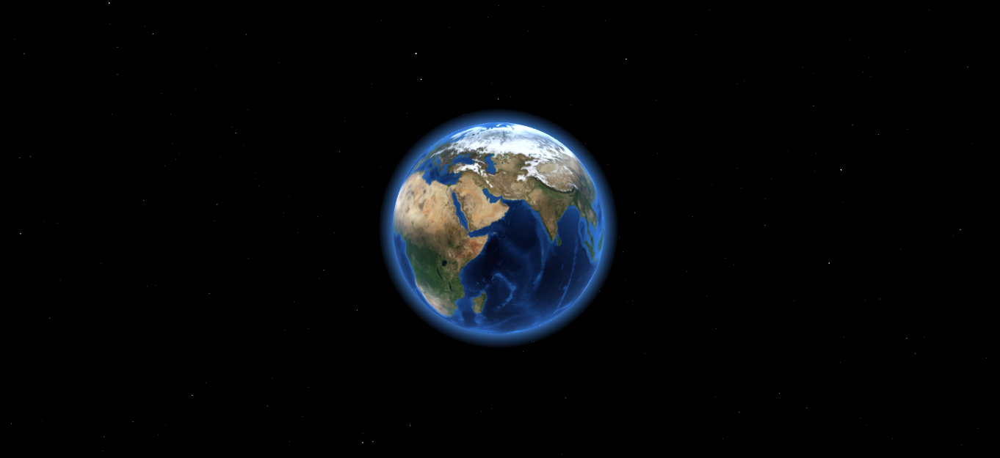

# Three.js App - 3D Globe

### Overview

A spinning Globe with Atmosphere in space.



Created by following a [clean code structure](https://pierfrancesco-soffritti.medium.com/how-to-organize-the-structure-of-a-three-js-project-77649f58fa3f) and the use of:

* Vite Framework
* Three.js libray
* Custom _vertex_ & _fragement_ shaders written in GLSL

### Setup

_Clone_ or _Download_ the project and navigate to the project folder.

```
npm install -g vite
npm install

npm run dev
```

Check out the final application [here](https://moskv08.github.io/vite-3dglobe-threejs/).

Have fun!